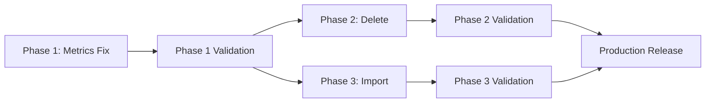

# ADR-007: Listings Valuation & Management Enhancements - Orchestration Strategy

**Status:** Accepted
**Date:** 2025-11-01
**Deciders:** Lead Architect
**Context:** Phases 1-3 Implementation Plan

---

## Context

We need to execute three independent but related enhancements to the listings valuation and management system:

1. **Phase 1:** Fix CPU adjusted metrics calculation bug (CRITICAL)
2. **Phase 2:** Add delete listing functionality (HIGH)
3. **Phase 3:** Add import button to catalog (MEDIUM)

This ADR defines the architectural decisions and delegation strategy for orchestrating these phases across specialized engineering agents.

---

## Decision

### 1. Architectural Patterns to Enforce

#### 1.1 Metrics Calculation Fix (Phase 1)

**Problem:** Current implementation incorrectly uses `adjusted_price` instead of `(base_price - adjustment_delta)` for CPU performance metrics.

**Architectural Decision:**
- **Location:** Keep calculation in `apps/api/dealbrain_api/services/listings.py` (NOT in packages/core)
- **Rationale:** This is orchestration logic (extracting JSON, calling domain logic), not pure domain logic
- **Pattern:** Service layer extracts `total_adjustment` from `valuation_breakdown.summary.total_adjustment`, then computes metrics

**Formula:**
```python
adjusted_base_price = base_price - total_adjustment
metric_adjusted = adjusted_base_price / cpu_mark
```

**Error Handling:**
- Default `total_adjustment` to `0.0` if `valuation_breakdown` is None
- Default `total_adjustment` to `0.0` if `summary` key missing
- Gracefully handle missing CPU benchmark data (return empty dict)

#### 1.2 Delete Cascade Strategy (Phase 2)

**Architectural Decision:**
- **Cascade Configuration:** SQLAlchemy relationship-level cascade (NOT database FK cascade)
- **Existing Configuration:** `Listing.components` and `Listing.score_history` already have `cascade='all, delete-orphan'`
- **Action Required:** Verify EntityFieldValue cascade for custom fields (likely needs relationship definition)

**Delete Endpoint Pattern:**
```python
@router.delete('/listings/{listing_id}', status_code=204)
async def delete_listing(listing_id: int, session: AsyncSession = Depends(session_dependency)):
    listing = await session.get(Listing, listing_id)
    if not listing:
        raise HTTPException(status_code=404, detail=f"Listing {listing_id} not found")
    await session.delete(listing)
    await session.commit()
```

**Service Layer Pattern:**
```python
async def delete_listing(session: AsyncSession, listing_id: int) -> None:
    listing = await session.get(Listing, listing_id)
    if not listing:
        raise ValueError(f"Listing {listing_id} not found")
    await session.delete(listing)
    await session.commit()
```

#### 1.3 React Query Cache Invalidation (Phases 2 & 3)

**Architectural Decision:**
- **Pattern:** Invalidate `['listings']` query key after mutations
- **Scope:** Invalidate entire cache (not individual keys) to ensure consistency
- **Location:** In mutation `onSuccess` callback

**Implementation:**
```typescript
const { mutate: deleteListing } = useMutation({
  mutationFn: async (id: number) => {
    const res = await fetch(`${API_URL}/listings/${id}`, { method: 'DELETE' });
    if (!res.ok) throw new Error('Failed to delete listing');
  },
  onSuccess: () => {
    queryClient.invalidateQueries({ queryKey: ['listings'] });
    toast.success('Listing deleted');
  },
});
```

#### 1.4 Modal Component Extraction (Phase 3)

**Architectural Decision:**
- **Location:** `apps/web/components/listings/import-modal.tsx` (domain-specific, not generic UI)
- **Props Interface:**
  ```typescript
  interface ImportModalProps {
    open: boolean;
    onOpenChange: (open: boolean) => void;
    onSuccess?: () => void;
  }
  ```
- **Pattern:** Extract form logic, maintain existing import mutation, add success callback

---

## 2. Subagent Delegation Strategy

### Phase 1: Adjusted Valuation Calculation Fix

| Task | Subagent | Rationale | Validation |
|------|----------|-----------|------------|
| **1.1: Fix Metrics Calculation** | `python-backend-engineer` | Python/FastAPI expertise, SQLAlchemy knowledge | Unit tests pass, no schema changes |
| **1.2: Audit Metrics Usage** | `codebase-explorer` | Quick symbol search across frontend/backend | Comprehensive file list with usage patterns |
| **1.3: Test Coverage** | `python-backend-engineer` | pytest expertise, async testing | ≥95% coverage, 5+ test cases |
| **1.4: Recalculation Script** | `python-backend-engineer` | Async SQLAlchemy, bulk operations | Script runs successfully on test data |

### Phase 2: Delete Listing Functionality

| Task | Subagent | Rationale | Validation |
|------|----------|-----------|------------|
| **2.1: Backend Delete Endpoint** | `python-backend-engineer` | FastAPI routes, service layer, cascade deletes | 204 on success, 404 on not found |
| **2.2: Detail Modal Delete UI** | `ui-engineer` | React Query mutations, Radix UI, accessibility | Cache invalidation works, toast shows |
| **2.3: Detail Page Delete UI** | `ui-engineer` | Next.js routing, React Query | Navigation to /listings works |
| **2.4: Confirmation Dialog** | `ui-engineer` | Radix Dialog, WCAG 2.1 AA compliance | Keyboard navigation works (Tab, Esc, Enter) |

### Phase 3: Import Button in Catalog

| Task | Subagent | Rationale | Validation |
|------|----------|-----------|------------|
| **3.1: Extract Import Modal** | `ui-engineer` | Component extraction, React patterns | Modal reusable, props documented |
| **3.2: Add Import Button** | `ui-engineer` | Next.js App Router pages, Tailwind CSS | Button visible, styled consistently |
| **3.3: Wire Modal Trigger** | `ui-engineer` | React Query cache invalidation | Catalog refreshes after import |

---

## 3. Execution Order

### Sequential Dependencies



**Key Insight:** Phases 2 and 3 can run in **parallel** after Phase 1 validation.

### Phase 1: Sequential (No Parallelism)

1. **Task 1.1** (Fix Calculation) → Must complete first
2. **Task 1.2** (Audit Usage) → Depends on understanding new calculation
3. **Task 1.3** (Tests) → Depends on final implementation
4. **Task 1.4** (Script) → Depends on tested calculation logic

**Rationale:** Each task builds on the previous. No parallelism opportunities.

### Phase 2: Parallel Opportunities

1. **Task 2.1** (Backend Endpoint) → Independent
2. **Task 2.4** (Confirmation Dialog) → Can start in parallel with 2.1
3. **Task 2.2** (Detail Modal UI) → Depends on 2.1 + 2.4
4. **Task 2.3** (Detail Page UI) → Depends on 2.1 + 2.4

**Optimization:** Start 2.1 and 2.4 in parallel, then 2.2 and 2.3 in parallel.

### Phase 3: Sequential (Tight Coupling)

1. **Task 3.1** (Extract Modal) → Must complete first
2. **Task 3.2** (Add Button) → Depends on 3.1
3. **Task 3.3** (Wire Trigger) → Depends on 3.1 + 3.2

**Rationale:** Modal extraction must complete before integration.

---

## 4. Commit Strategy

### Phase 1 Commits

1. **After Task 1.1:** `feat(api): fix CPU adjusted metrics calculation formula`
2. **After Task 1.3:** `test(api): add comprehensive CPU metrics test coverage`
3. **After Task 1.4:** `chore(scripts): add bulk metrics recalculation script`

**Do NOT commit after Task 1.2** (audit is documentation, tracked in progress.md)

### Phase 2 Commits

1. **After Task 2.1:** `feat(api): add DELETE endpoint for listings`
2. **After Task 2.4:** `feat(web): add accessible confirmation dialog component`
3. **After Task 2.2 + 2.3:** `feat(web): add delete functionality to listing detail views`

### Phase 3 Commits

1. **After Task 3.1:** `refactor(web): extract import modal to shared component`
2. **After Task 3.2 + 3.3:** `feat(web): add import button to catalog header`

---

## 5. Validation Checkpoints

### Phase 1 Validation (BEFORE proceeding to Phases 2 & 3)

- [ ] All 4 metrics fields use new formula
- [ ] Unit tests pass (≥95% coverage)
- [ ] Integration test passes (full rule evaluation pipeline)
- [ ] Audit documented with no conflicting usages
- [ ] Recalculation script tested on development data
- [ ] No regressions in existing metrics display

### Phase 2 Validation

- [ ] DELETE endpoint returns 204 for valid ID
- [ ] DELETE endpoint returns 404 for invalid ID
- [ ] Cascade deletes verified (components, scores, field values)
- [ ] Delete button visible in both detail views
- [ ] Confirmation dialog is keyboard accessible
- [ ] Cache invalidation works correctly
- [ ] Navigation to /listings works from detail page

### Phase 3 Validation

- [ ] ImportModal component is reusable
- [ ] Import button styled consistently
- [ ] Modal opens/closes correctly
- [ ] Success toast shows import count
- [ ] Catalog refreshes after import
- [ ] No performance regression vs. current /import page

---

## 6. Risk Mitigation

### Risk: Metrics Change Breaks Dashboards

**Impact:** HIGH
**Mitigation:** Task 1.2 audit ensures all usages documented
**Validation:** Manual testing of all views displaying adjusted metrics

### Risk: Cascade Delete Removes Unintended Records

**Impact:** HIGH
**Mitigation:** Verify SQLAlchemy relationships before implementing
**Validation:** Integration test verifying only related records deleted

### Risk: Bulk Recalculation Fails Mid-Run

**Impact:** MEDIUM
**Mitigation:** Add transaction handling and progress checkpoints
**Validation:** Test on development data with 100+ listings

### Risk: Import Modal Latency

**Impact:** LOW
**Mitigation:** Reuse existing import service (no new complexity)
**Validation:** Performance testing vs. current /import page

---

## Alternatives Considered

### 1. Move Metrics Calculation to packages/core

**Rejected:** Metrics calculation is orchestration logic (extracting JSON, coordinating data), not pure domain logic. Domain logic would be "compute valuation adjustment" (already in packages/core).

### 2. Database-Level Cascade Deletes

**Rejected:** SQLAlchemy ORM-level cascades provide better observability, logging, and control. Database FK cascades are too implicit.

### 3. Optimistic UI Updates for Delete

**Rejected:** Delete is a destructive operation. Conservative approach (wait for success) is safer for user trust.

### 4. Separate Import Modal Package

**Rejected:** Import logic is domain-specific (listings). Keep in domain component directory.

---

## Consequences

### Positive

- **Accurate Metrics:** Users see correct CPU value calculations
- **Self-Service Deletion:** Users can clean up their own data
- **Streamlined Workflow:** Import from catalog improves UX
- **Maintainable Architecture:** Clear layer boundaries and patterns
- **Testable Implementation:** Comprehensive test coverage ensures quality

### Negative

- **Bulk Recalculation Required:** Existing listings need one-time script run
- **Frontend Audit Required:** Must verify all metrics usages (mitigated by Task 1.2)
- **No Undo for Delete:** Destructive operation (mitigated by confirmation dialog)

### Neutral

- **No Schema Migrations:** All changes use existing database structure
- **No API Breaking Changes:** Only addition (DELETE endpoint)

---

## Follow-Up Tasks

1. **After Phase 1:** Run bulk recalculation script in staging, then production
2. **After Phase 2:** Monitor delete usage metrics and error rates
3. **After Phase 3:** Consider deprecating standalone /import page if adoption is high
4. **Future:** Add soft delete / archive functionality for safer deletion

---

## References

- **Implementation Plan:** `/mnt/containers/deal-brain/docs/project_plans/listings-valuation-enhancements/IMPLEMENTATION_PLAN.md`
- **PRD:** `/mnt/containers/deal-brain/docs/project_plans/listings-valuation-enhancements/PRD.md`
- **Progress Tracker:** `/mnt/containers/deal-brain/docs/project_plans/listings-valuation-enhancements/progress/phase-1-3-progress.md`
- **Context Doc:** `/mnt/containers/deal-brain/docs/project_plans/listings-valuation-enhancements/context/listings-valuation-enhancements-context.md`
