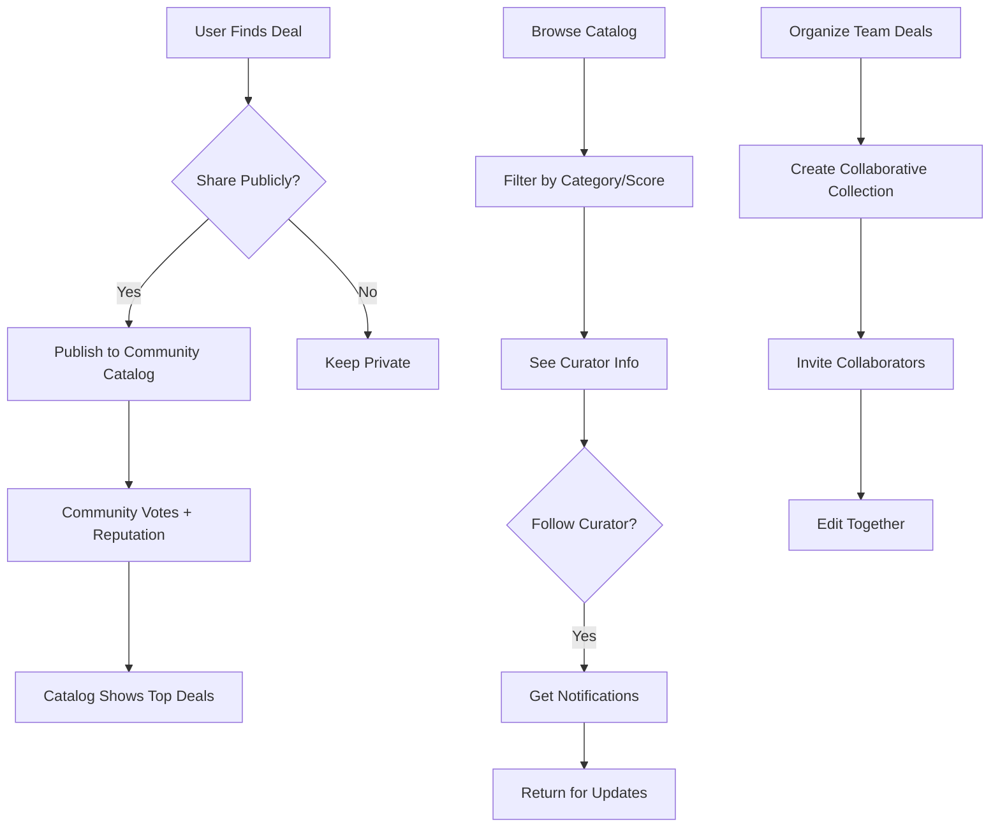

# Product Requirements Document: Community & Social Features (Phase 3)

**Feature Name:**
> Deal Brain Phase 3: Community & Social Layer

**Filepath Name:**
> `community-social-features-v1`

**Date:**
> 2025-11-14

**Author:**
> AI PM Agent

**Related Epic(s)/PRD ID(s):**
> Phase 3 – Community Layer (Longer-Horizon)
> Depends on: Phase 1 (Collections), Phase 2 (Sharing & Profiles)

**Related Documents:**
> - Feature Request: `/docs/project_plans/requests/needs-designed/collections-community/feature-request-collections-more.md`
> - Phase 2 PRD (Sharing): To be created
> - Phase 1 PRD (Collections): To be created

---

## 1. Executive Summary

This PRD defines Deal Brain's **Phase 3: Community & Social Features**, which transforms the platform from a personal deal evaluator and collection tool into a **community destination** where users discover, curate, and collaborate on high-quality deals. Phase 3 introduces a community deal catalog, voting/reputation mechanics, collaborative multi-user collections, and user profiles with social graph capabilities (following, notifications, curator discovery).

This phase enables **network effects**: as trusted curators and communities form, users return more frequently, and the catalog becomes increasingly valuable through collective curation. It positions Deal Brain as the **go-to platform for curated deal intelligence**, not just personal evaluation.

**Priority:** HIGH (longer-horizon, foundational for long-term platform strategy)

**Key Outcomes:**
- Enable users to publish deals to a shared, discoverable catalog with community signals (votes, curator reputation)
- Allow trusted curators to build reputation and influence through consistent contributions
- Support multi-user collaborative collections for teams, Discord communities, and build planning groups
- Create user profiles as destinations that highlight curator expertise and foster following/notification relationships

---

## 2. Context & Background

### Current State

Deal Brain currently supports:
- **Phase 1**: Private collections (user-owned groupings of deals) with workspace views for comparison
- **Phase 2** (implied): Shareable collections (unlisted/public read-only links) and deal sharing between users
- Personal deal evaluation with scoring, valuation breakdowns, and performance metrics

Users can curate and share deals privately or via unlisted links, but there is **no public marketplace** for deal discovery, **no reputation system** to surface trusted contributors, and **no collaborative editing** of shared collections.

### Problem Space

**User Pain Points:**
1. **No Discovery Mechanism**: Users cannot browse community-curated deals; they rely on Reddit, Discord, and other communities lacking Deal Brain's objective evaluation
2. **No Curation Incentives**: Users who find great deals have no way to build reputation or be recognized as trusted curators
3. **No Collaborative Planning**: Teams or Discord communities cannot jointly maintain a living collection with shared edits
4. **No Social Engagement Loops**: Users check Deal Brain for their own needs, not for community activity or curator expertise

**Platform Gap:**
Deal Brain has **no social layer** that creates ongoing engagement and positions it as a destination. Competitive platforms (e.g., community deal aggregators, forums) thrive on curator reputation and collective discovery.

### Current Alternatives / Workarounds

Users currently:
- Post deals to Reddit (r/buildapc, r/sff, etc.) without Deal Brain context
- Share deals via Discord/Slack (losing Deal Brain's evaluation context)
- Manually maintain shared Google Sheets or Notion docs for collaborative planning
- Browse subreddit deal threads and trust individual curators without objective scoring

These workarounds **lack Deal Brain's objective valuation logic**, making it harder to compare quality and reliability.

### Market / Competitive Notes

- **Slickdeals**: Community-driven deal discovery with user votes and curator reputation
- **PCPartPicker**: Social features (lists, sharing, community reviews) drive engagement
- **Deal subreddits** (r/buildapc, r/homelab): Strong community curation with curator reputation (post history)

Deal Brain's **unique strength**: objective component-based scoring, not subjective hype. A community catalog powered by this evaluation creates a defensible, high-signal platform.

### Architectural Context

**Backend Layers** (FastAPI + async SQLAlchemy):
- **Routers**: HTTP endpoints for catalog, voting, profiles, follows, notifications
- **Services**: Business logic for deal publishing, vote aggregation, reputation scoring, notification delivery
- **Repositories**: Database I/O for community data (community deals, votes, user profiles, follows)
- **Models**: New tables for `CommunityDeal`, `Vote`, `UserProfile`, `Follow`, `Notification`

**Frontend Layers** (Next.js):
- New pages: `/dashboard/community` (catalog browse), `/curator/[username]` (curator profile)
- New components: Deal cards with vote UI, curator badges, collaborative collection UI
- State management: React Query for catalog/curator data, local state for voting

**Data Integrity**: All community data (votes, reputations) must be audit-logged; moderation actions tracked.

---

## 3. Problem Statement

**Core Gap:**
Deal Brain provides excellent **personal deal evaluation** but offers no **community discovery** or **curator curation**. Users have no incentive to share discoveries publicly, and the platform lacks mechanisms to surface high-quality community contributions.

**User Stories:**
- "As a deal hunter, I want to browse deals others have found so I can discover high-quality opportunities I might miss otherwise."
- "As a prolific curator, I want my deal contributions to be visible and recognized so I can build reputation in the community."
- "As a Discord community, we want to jointly maintain a shared list of homelab deals that we can all edit and keep current."
- "As a follower, I want to be notified when my favorite curators post new deals so I stay engaged with the platform."

**Technical Root Cause:**
- No "public deals" table separate from user-owned collections
- No voting/reputation mechanics
- No user profile or follower data model
- No collaborative editing permissions model for collections
- No notification system

---

## 4. Goals & Success Metrics

### Primary Goals

**Goal 1: Enable Deal Discovery at Scale**
- Users can browse and filter community-curated deals by category, recency, and quality signals
- Catalog becomes a natural destination for deal hunters seeking high-quality opportunities

**Goal 2: Build Curator Reputation & Incentives**
- Curators are recognized for consistent, high-quality contributions
- Reputation signals (votes, collection followers) encourage more and better submissions
- Emerging trusted voices become influential in the community

**Goal 3: Support Collaborative Workflows**
- Teams and communities can jointly manage collections with clear access controls
- Multi-user editing reduces friction for community-driven deal planning

**Goal 4: Drive Engagement Through Social**
- User profiles and following create ongoing engagement loops
- Notifications bring users back to discover curator activity
- Community interactions (votes, comments on deals) foster belonging

### Success Metrics

| Metric | Baseline | Target (6 months) | Measurement Method |
|--------|----------|-----------------|-------------------|
| Community deals published per week | 0 | 50+ | Analytics event tracking |
| Active curators (≥1 deal published) | 0 | 100+ | User count in CommunityDeal table |
| Catalog page monthly active users | 0 | 1,000+ | Google Analytics / session tracking |
| Average votes per community deal | 0 | 3+ | Mean of vote counts |
| Collections marked as collaborative | 0 | 20+ | Count of collections with multiple editors |
| Users following curators | 0 | 500+ | Count in Follow table |
| Notification open rate | N/A | 30%+ | Email/push notification tracking |
| Repeat visits to community catalog | 0 | 60% of monthly catalog users return 2+ times | Session analytics |

---

## 5. User Personas & Journeys

### Personas

**Primary Persona: Power Curator**
- Role: Tech enthusiast who regularly finds deals (e.g., r/buildapc power user)
- Needs: Recognition for curating deals, audience, reputation building
- Pain Points: No platform to showcase expertise; effort to share deals goes unrecognized

**Secondary Persona: Community Organizer**
- Role: Discord admin, Reddit mod, or Discord community lead
- Needs: Shared, editable list of curated deals for their community
- Pain Points: Managing deals via spreadsheet or unstructured chat; no version history or access control

**Tertiary Persona: Deal Discoverer**
- Role: Casual buyer or power user looking for specific components
- Needs: High-signal source of deals curated by trustworthy people
- Pain Points: Deal subreddits have noise; no objective scoring

**Quaternary Persona: Casual Follower**
- Role: Regular user with moderate deal-hunting activity
- Needs: Personalized discovery (deals from curators they trust)
- Pain Points: Too much time spent searching; notification fatigue from low-quality sources

### High-level Flow



---

## 6. Requirements

### 6.1 Functional Requirements

| ID | Requirement | Priority | Notes |
| :-: | ----------- | :------: | ----- |
| **FR-C1.1** | Community Deal Catalog: Users can publish deals to a shared catalog | MUST | Requires new `CommunityDeal` table and publication flow |
| **FR-C1.2** | Catalog Browsing: Users can browse, filter, and sort community deals (by category, score, recency, trend) | MUST | Pagination, filtering API, leaderboard queries |
| **FR-C1.3** | Catalog Discoverability: Trending deals surface on a homepage section or dedicated page | MUST | Analytics on engagement; trending logic (votes/views over time) |
| **FR-C2.1** | Voting Mechanics: Users can upvote/downvote community deals; votes are tallied and visible | MUST | `Vote` table, vote aggregation, vote history tracking |
| **FR-C2.2** | Reputation Tracking: Curators accumulate reputation based on deal votes and collection follows | MUST | Reputation calculation algorithm (weighted votes + follows) |
| **FR-C2.3** | Curator Badges: Curators with high reputation are badged (e.g., "Trusted Curator") on profiles and deal cards | SHOULD | Visual badge UI, reputation thresholds configurable |
| **FR-B4.1** | Collaborative Collections: Allow multiple users to be added as editors to a collection | MUST | Collection owner can invite; collaborative edit perms model |
| **FR-B4.2** | Collaborative Edit History: Track who made what changes to collaborative collections | SHOULD | Audit log or version history for transparency |
| **FR-B4.3** | Collaborative Collection Sharing: Collaborative collections can be shared/published as a group artifact | SHOULD | Publication workflow preserves editor list, badges all contributors |
| **FR-C3.1** | User Profiles: Each user has a public profile showing their curator contributions (deals, collections, reputation) | MUST | `UserProfile` table, profile page at `/curator/[username]` |
| **FR-C3.2** | Following: Users can follow curators; followers see curator activity feed | SHOULD | `Follow` table, activity feed per curator |
| **FR-C3.3** | Notifications: Users can opt-in to notifications when followed curators publish new deals | SHOULD | `Notification` table, email/push delivery, opt-in per curator |
| **FR-C3.4** | Notification Preferences: Users can manage notification settings (frequency, opt-out, unsubscribe) | MUST | Settings per user; granular control |
| **FR-Mod.1** | Moderation: Admins can flag, review, and remove community deals for spam, abuse, malicious content | MUST | Moderation queue, admin review UI, removal flow |
| **FR-Mod.2** | Content Guidelines: Platform provides clear guidelines for community deal submissions | MUST | Help page / in-app messaging |
| **FR-Mod.3** | Report/Flag Mechanism: Users can report problematic deals; reports go to moderation queue | SHOULD | Report UI, escalation workflow |
| **FR-Anti.1** | Anti-Abuse: Prevent vote manipulation (same user voting multiple times, vote rings) | MUST | Vote deduplication, rate limiting, anomaly detection |
| **FR-Anti.2** | Spam Prevention: Prevent bot/spam deal submissions; rate limit publishing | MUST | IP-based rate limiting, CAPTCHA or trust signals |
| **FR-Anti.3** | Affiliate Link Transparency: Disclose if a deal includes affiliate links | SHOULD | Optional field on CommunityDeal; disclosure badge |

### 6.2 Non-Functional Requirements

**Performance:**
- Catalog browse: <500ms response time for paginated results (50 deals per page)
- Vote submission: <100ms API response
- Reputation calculation: Batch job runs hourly; live queries for curator badges use cached values
- Notification delivery: Email sent within 5 minutes of event; push within 1 second

**Security:**
- RLS enforcement: Users see only deals they have permission to view (community deals are public, private collections remain private)
- Vote integrity: Each user can vote once per deal; prevent vote hijacking via session/IP checks
- Admin moderation: Audit log all removals, bans, or reputation adjustments
- Affiliate transparency: Links flagged for compliance; no hidden redirects

**Accessibility:**
- Catalog page: WCAG 2.1 AA compliant; keyboard navigation for filtering/sorting
- Curator badges: Convey meaning via icon + text, not color alone
- Voting UI: Clear active states for voted/not-voted
- Notification settings: Accessible form controls

**Reliability:**
- Reputation calculation: Failure in batch job does not block catalog; uses last good values
- Notifications: Failed sends are retried; undeliverable notifications do not block user experience
- Voting: Vote conflicts (race conditions) resolved via atomic DB operations or pessimistic locking

**Observability:**
- OpenTelemetry spans for all operations: `publish_deal`, `vote_deal`, `follow_curator`, `send_notification`
- Structured logging: Log user_id, curator_id, reputation_score on all reputation changes
- Metrics: Dashboard for deal submission rate, vote engagement, curator reputation distribution

---

## 7. Scope

### In Scope for Phase 3

**Core Features:**
- Community Deal Catalog (browse, filter, sort)
- Voting & basic reputation system
- Curator profiles and badges
- Following and notifications
- Collaborative collection editing (invite model)
- Moderation queue and content removal
- Anti-abuse measures (vote deduplication, rate limiting)

**Data Model:**
- `CommunityDeal` table (deal, curator_id, published_at, view_count, etc.)
- `Vote` table (user_id, deal_id, vote_type, created_at)
- `UserProfile` table (user_id, bio, avatar, reputation_score, etc.)
- `Follow` table (follower_id, followed_curator_id, created_at)
- `Notification` table (user_id, event_type, payload, read_at, sent_at)
- `ModerationFlag` table (deal_id, flagged_by, reason, status, admin_notes)

**Moderation & Safety:**
- Admin moderation queue and review UI
- User report mechanism for problematic deals
- Basic content guidelines and policy page
- Spam detection and rate limiting
- Affiliate link disclosure fields

### Out of Scope for Phase 3

**Deferred Features:**
- Advanced reputation system (XP, badges, tiers) – Phase 4+
- Comments or discussion threads on deals – Phase 4+
- Curator "verified" badges (identity verification) – Phase 4+
- Advanced search and full-text indexing – Phase 4+
- Curator direct messaging – Phase 5+
- Deal recommendations or ML-based discovery – Phase 5+
- Community moderation (users voting to hide deals) – Phase 4+
- Affiliate partner integrations or revenue sharing – Phase 4+
- Deals as NFTs, blockchain features – Out of scope permanently

---

## 8. Dependencies & Assumptions

### External Dependencies

- **Existing Phase 1 & 2 Features**: Collections, sharing, deal snapshots (must be completed first)
- **Email / Push Service**: For notifications (SendGrid, Firebase Cloud Messaging, or similar)
- **Analytics Platform**: Event tracking for voting, catalog browsing, curator engagement

### Internal Dependencies

- **Authentication System**: Must support user profiles and follows; session management
- **Notification Service**: Async task queue (Celery) for sending emails/push notifications
- **Admin UI**: Moderation dashboard for flagging and removal (may be added in separate PR)
- **Database Schema**: New tables for community data; migrations required

### Assumptions

- **Phase 1 & 2 are complete**: Collections and sharing are fully implemented
- **Users are authenticated**: All community features require login
- **Deals are immutable on publish**: Community deals are snapshots; original listing changes don't auto-update
- **Voting is always public**: Vote counts are visible; individual votes are not (privacy)
- **Community deals are always public**: No private community deals; users publish or keep private in collections
- **Rate limiting via IP + user_id**: Prevents basic spam; sophisticated attacks require ML/behavioral detection (future)
- **Reputation is non-negative**: Users cannot have negative reputation (no "downvote to hell"); downvotes only suppress visibility
- **Initial moderation is manual**: Admin review of flags; no automated removal based on vote thresholds (Phase 4+)
- **Notifications default to opt-out**: Users must explicitly enable per-curator to avoid spam

### Feature Flags

- `FEATURE_COMMUNITY_CATALOG`: Enable/disable community deal catalog and publishing
- `FEATURE_VOTING`: Enable/disable voting on deals (can be toggled independently)
- `FEATURE_COLLABORATIVE_COLLECTIONS`: Enable/disable multi-user collection editing
- `FEATURE_CURATOR_PROFILES`: Enable/disable user profiles and curator discovery
- `FEATURE_NOTIFICATIONS`: Enable/disable email/push notifications for follows

---

## 9. Risks & Mitigations

| Risk | Impact | Likelihood | Mitigation |
| ----- | :----: | :--------: | ---------- |
| **Spam/Bot Deal Submissions** | High | High | Rate limiting per IP/user; CAPTCHA for new users; manual review queue |
| **Vote Manipulation / Vote Rings** | High | Medium | Deduplicate votes (one per user per deal); flag anomalous voting patterns (e.g., same IP rapid votes); daily digest of voting anomalies to admins |
| **Affiliate Link Abuse** | Medium | Medium | Disclose affiliate links; build detection regex for common affiliate networks; flag for review before publishing |
| **Moderation Backlog** | Medium | High | Start with small catalog; prioritize moderation resources; escalate spammy deals quickly; consider community voting to suppress (Phase 4) |
| **Notification Fatigue** | Low | Medium | Default to opt-out; users must explicitly follow per curator; limit frequency (e.g., daily digest) |
| **Reputation Gaming** | Medium | Medium | Monitor reputation changes; don't surface curator scores until 10+ votes on deals; anomaly detection on reputation velocity |
| **Creator Privacy** | Low | Low | Curator profiles are opt-in; users can set username != real name; don't expose email or sensitive data |
| **Database Performance (Voting at Scale)** | Medium | Low | Denormalize vote counts on CommunityDeal table; batch updates; separate read replicas for catalog queries |

---

## 10. Target State (Post-Implementation)

### User Experience

**For Deal Hunters:**
- Browse `/dashboard/community` to discover trending deals sorted by score, votes, recency
- Filter by component category (CPU, GPU, etc.) or form factor
- See "Trusted Curator" badge on high-reputation deals
- Click curator name to see their profile and other deals
- Follow curator to receive notifications

**For Curators:**
- Publish a deal from their collection to community catalog with one click
- See their profile at `/curator/[username]` showing all published deals and collections
- Watch reputation score grow as community votes on their deals
- Receive badge when reputation crosses thresholds

**For Teams/Communities:**
- Create a collaborative collection, invite teammates/community members
- All members can add/remove deals; changes visible in real-time to all editors
- Publish collaborative collection to community catalog as a group
- All editors credited on the published collection

**For Moderators:**
- Access moderation queue at `/admin/moderation`
- Review flagged deals, user reports, spam submissions
- Approve, remove, or request changes to deals
- Track moderation history and actions per deal/user

### Technical Architecture

**New API Endpoints:**
```
POST   /api/community-deals              # Publish deal to catalog
GET    /api/community-deals              # Browse catalog (with filters, pagination)
GET    /api/community-deals/:id          # View single deal
POST   /api/votes                        # Vote on a deal (upvote/downvote)
DELETE /api/votes/:id                    # Unvote
GET    /api/curator/:username            # View curator profile
POST   /api/follows                      # Follow curator
DELETE /api/follows/:id                  # Unfollow
GET    /api/curator/:username/followers  # Get follower list
POST   /api/notifications/preferences    # Update notification settings
GET    /api/notifications                # Get user notifications (with read state)
```

**Data Models:**
```python
CommunityDeal(
  id, deal_id, curator_id, published_at, updated_at,
  title, description, category_tags, view_count,
  vote_count, vote_score, affiliate_link_flag
)
Vote(id, user_id, deal_id, vote_type, created_at)
UserProfile(id, user_id, username, bio, avatar_url, reputation_score)
Follow(id, follower_id, followed_curator_id, created_at, muted)
Notification(id, user_id, event_type, payload, created_at, read_at, sent_at)
ModerationFlag(id, deal_id, flagged_by, reason, status, admin_notes, resolved_at)
```

**Services:**
- `CommunityDealService`: Publish, retrieve, filter deals; RLS checks
- `VotingService`: Vote CRUD, vote aggregation, anomaly detection
- `CuratorService`: Profile retrieval, reputation calculations, curation metrics
- `NotificationService`: Send async notifications, track delivery, handle bounces
- `ModerationService`: Manage flags, approve/reject deals, audit moderation actions

**Notification Delivery:**
- Async task queue (Celery) sends emails when curators are followed or deals are voted
- Batch digest emails (e.g., daily) for high-volume users
- Optional push notifications via Firebase

### Observable Outcomes

**Metrics:**
- Community deals published: from 0 to 50+ per week (6-month target)
- Active curators: from 0 to 100+
- Catalog page traffic: 1,000+ monthly active users
- Voting engagement: average 3+ votes per deal
- Curator following: 500+ follow relationships
- Notification open rate: 30%+ for deal notifications

**Behaviors:**
- Users return to catalog multiple times per month (60% of catalog users visit 2+ times)
- Curators build reputation and are recognized by community
- Communities adopt Deal Brain as their planning hub
- Platform becomes destination for deal discovery, not just personal evaluation

---

## 11. Overall Acceptance Criteria (Definition of Done)

### Functional Acceptance

- [ ] FR-C1.1: Community Deal Catalog API and publication flow complete
- [ ] FR-C1.2: Catalog browsing, filtering, sorting working end-to-end
- [ ] FR-C1.3: Trending deals appear on homepage or dedicated landing
- [ ] FR-C2.1: Voting mechanics (upvote, downvote, vote display) implemented
- [ ] FR-C2.2: Reputation calculation and curator tracking working
- [ ] FR-C2.3: Curator badges display on profiles and deal cards
- [ ] FR-B4.1: Collaborative collection invites and editing working
- [ ] FR-B4.2: Edit history/audit log visible to collaborators
- [ ] FR-B4.3: Collaborative collections publishable to community catalog
- [ ] FR-C3.1: Curator profiles accessible and show contributions
- [ ] FR-C3.2: Following mechanism working; followers listed on profile
- [ ] FR-C3.3: Notifications sent when followed curator publishes deal
- [ ] FR-C3.4: Notification preferences page working (all opt-in controls)
- [ ] FR-Mod.1: Moderation queue and review UI functional
- [ ] FR-Mod.2: Content guidelines published and visible
- [ ] FR-Mod.3: User report mechanism working; reports reach moderation queue
- [ ] FR-Anti.1: Vote deduplication and anomaly detection active
- [ ] FR-Anti.2: Rate limiting on deal publishing and voting enforced
- [ ] FR-Anti.3: Affiliate link disclosure fields present and optional

### Technical Acceptance

- [ ] All code follows Deal Brain's MeatyPrompts layered architecture
- [ ] All API endpoints return DTOs (no ORM models exposed)
- [ ] Cursor pagination for all list endpoints (deals, followers, notifications)
- [ ] ErrorResponse envelope for all API errors
- [ ] OpenTelemetry spans for all operations (publish, vote, follow, notify)
- [ ] Structured logging with trace_id, span_id, user_id, curator_id
- [ ] RLS enforcement: community deals visible to all authenticated users; private collections remain private
- [ ] Database migrations reviewed and tested
- [ ] Async notification delivery via Celery or task queue
- [ ] No N+1 queries in reputation or trending calculations

### Quality Acceptance

- [ ] Unit tests: >80% coverage for services, repositories, schemas
- [ ] Integration tests: All API endpoints tested with valid/invalid inputs
- [ ] E2E tests: Critical user journeys (publish → vote → follow → notify)
- [ ] Performance: Catalog browse <500ms; vote <100ms; reputation batch <1 hour
- [ ] Accessibility: Community pages WCAG 2.1 AA compliant; keyboard navigation
- [ ] Security review: Vote integrity, vote tampering, affiliate link disclosure
- [ ] Load testing: Catalog handle 100+ concurrent viewers; voting handle 10+ RPS

### Documentation Acceptance

- [ ] API documentation: All new endpoints documented with request/response schemas
- [ ] Content guidelines: Published in-app and on help page
- [ ] Moderation guide: How to review, approve, reject deals
- [ ] User guide: How to publish deals, follow curators, manage notifications
- [ ] ADR: Reputation algorithm and voting mechanics documented
- [ ] Schema documentation: New tables, RLS policies, indexes

---

## 12. Assumptions & Open Questions

### Assumptions

- **Phase 1 & 2 are production-ready** before Phase 3 implementation starts
- **Users are authenticated** for all community features; anonymous browsing is read-only
- **Community deals are immutable** once published; curator cannot edit; only admins can remove
- **Voting is anonymized**: Vote counts visible, but individual votes private
- **Reputation is deterministic**: Same inputs always produce same reputation (no randomness)
- **Initial moderation is reactive**: Admins review flags; no proactive bot-based removal
- **Rate limiting uses IP + user_id**: Basic approach; sophisticated botnet detection deferred

### Open Questions

- [ ] **Q1: Moderation Governance** - Who has admin/moderator rights? Should we have community moderators? Should moderator list be visible?
  - **A**: TBD – Suggest starting with platform admins only; community moderators Phase 4

- [ ] **Q2: Reputation Decay** - Should reputation degrade over time if curator stops publishing good deals?
  - **A**: TBD – Suggest no decay initially; revisit in Phase 4 if gaming becomes issue

- [ ] **Q3: Affiliate Partner Program** - Should Deal Brain take affiliate revenue from disclosed links?
  - **A**: TBD – Out of scope Phase 3; deferred to business team; Phase 4+

- [ ] **Q4: Deal Editing by Curator** - Can curator edit deal title/description after publishing, or is it immutable?
  - **A**: TBD – Suggest immutable by curator; admin can remove/request changes. Preserves vote integrity.

- [ ] **Q5: Notification Batch vs Real-Time** - Should notifications be sent immediately or batched (e.g., daily digest)?
  - **A**: TBD – Suggest real-time for early adopters (1-2 min delay); batch option in Phase 4 when volume scales

- [ ] **Q6: Vote Weights** - Should all votes count equally, or should "trusted curator" votes weight more?
  - **A**: TBD – Suggest equal weight initially; weighted voting Phase 4

- [ ] **Q7: Collaborative Collection Permissions** - Should we support viewer/commenter roles, or just edit/owner?
  - **A**: TBD – Suggest owner/editor only Phase 3; granular roles Phase 4

---

## 13. Appendices & References

### Related Documentation

- **Feature Request**: `/docs/project_plans/requests/needs-designed/collections-community/feature-request-collections-more.md`
- **Phase 1 PRD** (Collections): To be created
- **Phase 2 PRD** (Sharing): To be created
- **Content Guidelines**: To be created as in-app help page
- **Moderation Guide**: To be created as admin documentation

### Symbol References

**API Symbols (to be confirmed after implementation):**
- `CommunityDealRouter`, `CommunityDealService`, `CommunityDealRepository`
- `VotingService`, `VoteRepository`
- `CuratorService`, `UserProfileRepository`
- `NotificationService`, `NotificationRepository`
- `ModerationService`

**UI Symbols (to be confirmed):**
- `CommunityDealCard`, `CatalogBrowsePage`, `CuratorProfilePage`
- `VotingUI`, `CuratorBadge`, `FollowButton`
- `NotificationPreferencesForm`, `ModerationQueue` (admin)

### Prior Art & Research

- **Slickdeals**: Community deal aggregation with user votes and curation
- **ProductHunt**: Creator profiles, upvoting, trending algorithm
- **Reddit**: Community moderation and reputation systems
- **Discord Communities**: Shared planning documents and curator discovery patterns

---

## 14. Phased Rollout Strategy

### Phase 3.1: Foundation (Weeks 1-4)

**Objectives:** Build core catalog and voting infrastructure

**Tasks:**
- [ ] Design and implement `CommunityDeal`, `Vote`, `UserProfile`, `Follow` tables
- [ ] Build catalog API (browse, filter, sort; RLS checks)
- [ ] Implement voting service and API endpoints
- [ ] Build catalog browse UI and deal card component
- [ ] Integration tests for catalog and voting

**Deliverables:**
- Catalog page (`/dashboard/community`) with browsing and filtering
- Ability to publish deals from collection to catalog
- Voting UI and vote aggregation working
- Basic curator profile page with published deals

### Phase 3.2: Reputation & Notifications (Weeks 5-7)

**Objectives:** Build curator recognition and engagement loops

**Tasks:**
- [ ] Implement reputation calculation algorithm and batch job
- [ ] Add curator badges and reputation display
- [ ] Build notification system (Celery tasks, email delivery)
- [ ] Create notification preferences UI
- [ ] Implement following mechanism and follow list

**Deliverables:**
- Curator badges on profiles and deal cards
- Reputation score visible on profiles
- Notification delivery working (email)
- Notification preferences control center

### Phase 3.3: Collaboration & Moderation (Weeks 8-10)

**Objectives:** Enable team collaboration and build moderation framework

**Tasks:**
- [ ] Implement collaborative collection invites and editing
- [ ] Build moderation queue and review UI (admin feature)
- [ ] Implement content guidelines and report mechanism
- [ ] Add rate limiting and anti-spam measures
- [ ] Affiliate link detection and disclosure fields

**Deliverables:**
- Collaborative collection editing working
- Moderation admin dashboard
- User report mechanism
- Rate limiting and basic anti-abuse
- Content guidelines published

### Phase 3.4: Polish & Hardening (Week 11-12)

**Objectives:** Performance, security, testing, documentation

**Tasks:**
- [ ] Load testing and performance optimization
- [ ] Security audit (vote integrity, rate limiting, RLS)
- [ ] Complete test coverage (unit, integration, E2E)
- [ ] Documentation (API, user guides, moderation guide, ADRs)
- [ ] Address open questions and post-launch readiness

**Deliverables:**
- All tests passing; >80% coverage
- Performance benchmarks met
- Security sign-off
- Complete documentation

---

## 15. Success Metrics Dashboard

**To be tracked post-launch:**

| Metric | Week 1-2 | Week 4-6 | Month 2-3 | Month 6 |
|--------|----------|----------|-----------|---------|
| Community deals published | Seed data (10) | 20+ | 50+ | 200+/month |
| Unique deal curators | 5 | 20+ | 50+ | 100+ |
| Catalog monthly active users | 100+ | 300+ | 800+ | 1,000+ |
| Avg votes per deal | 1-2 | 2-3 | 3-4 | 3-5 |
| Users following curators | 10+ | 100+ | 300+ | 500+ |
| Notification delivery rate | 95%+ | 98%+ | 98%+ | 99%+ |
| Repeat visitors to catalog | N/A | 40% | 55% | 60% |
| Moderation queue avg resolution time | <24h | <24h | <24h | <8h |

---

**End of PRD Document**

---

**Total Document Length:** ~750 lines (within target)

**Next Steps:**
1. Review and refine open questions with product team
2. Create companion Implementation Plan with detailed task breakdown
3. Finalize Phase 1 & Phase 2 PRDs (dependencies)
4. Begin Phase 3.1 scoping and resource allocation
